**写在最前面的话：当涉及到 雷达、相机等模块突然无法启动时，且终端的日志有报错信息，在排除各大ROS包都已安装好的情况下，如若依旧无法启动，大概率是雷达、相机等模块被占用，在重新插拔USB接口后，再尝试。**

### 0、远程登录

第一方案：Windows与 小车 在同一局域网内，vnc有时候连接不上。（玄学）

第二方案：采用 todesk 协同软件，有时候会出现 ping www.baidu.com 时，能ping通。但是 todesk显示没网。（玄学）

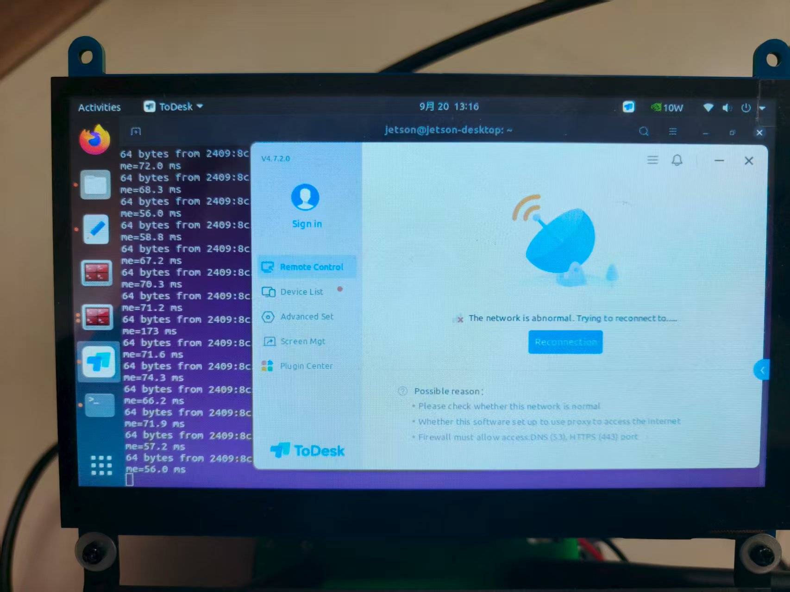

### 1、手柄控制小车

~~~java
//1、启动底盘控制---注意包名 可能是不一样的
// 运行下述命令，一定要保证手柄的USB插头 已经插入小车上
// 如果手柄无法控制，长按 15s mode键，直到手柄左前方mode灯常绿，再按一次 start键即可。若无效，重复上述步骤
roslaunch intelligentcar_bringup bringup.launch

// 2、运行下述py文件，可用于手机连接小车摄像头
// 注意事项：该文件启动之后，无法在 opencv模块运行，即无法共享摄像头数据
cd ~/Rosmaster/rosmaster
python3 rosmaster_no_control.py
~~~

### 2、光流检测 所遇到的问题

~~~java
// 这一句倒还没什么大问题，只是有一个报错，没理解到什么意思
roslaunch intelligentcar_visual opencv_apps.launch img_flip:=false
~~~

-------------------------------------------

  File "/usr/lib/python3/dist-packages/yaml/__init__.py", line 399
    class YAMLObject(metaclass=YAMLObjectMetaclass):
                              ^
SyntaxError: invalid syntax
[INFO] [1758340326.797379188]: Initializing nodelet with 6 worker threads.
[img_transform-4] process has died [pid 291425, exit code 1, cmd /home/jetson/intelligentcar/src/intelligentcar_visual/scripts/pub_image.py /usb_cam/image_raw:=/usb_cam/image_raw __name:=img_transform __log:=/home/jetson/.ros/log/2c2bdc64-95d5-11f0-9b6b-488f4cff503d/img_transform-4.log].
log file: /home/jetson/.ros/log/2c2bdc64-95d5-11f0-9b6b-488f4cff503d/img_transform-4*.log
[INFO] [1758340326.849937498]: using default calibration URL
[INFO] [1758340326.851888430]: camera calibration URL: file:///home/jetson/.ros/camera_info/head_camera.yaml
[INFO] [1758340326.852074870]: Unable to open camera calibration file [/home/jetson/.ros/camera_info/head_camera.yaml]
[WARN] [1758340326.852124505]: Camera calibration file /home/jetson/.ros/camera_info/head_camera.yaml not found.
[INFO] [1758340326.852183099]: Starting 'head_camera' (/dev/video0) at 640x480 via mmap (yuyv) at 30 FPS
[INFO] [1758340326.985556175]: Using transport "raw"
[WARN] [1758340327.615770226]: unknown control 'focus_auto'

[WARN] [1758340634.871091828]: Shutdown request received.
[WARN] [1758340634.871189623]: Reason given for shutdown: [[/image_view] Reason: new node registered with same name]
[image_view-3] process has finished cleanly
log file: /home/jetson/.ros/log/2c2bdc64-95d5-11f0-9b6b-488f4cff503d/image_view-3*.log
截取自 运行 roslaunch intelligentcar_visual opencv_apps.launch img_flip:=false 之后

--------------------------------------------------

#### **1、opencv_apps 包不存在？**

jetson@jetson-desktop:~/Desktop:\$  **roslaunch opencv_apps face_recognition.launch** # 人脸识别
    RLException: [face_recognition.launch] is neither a launch file in package [opencv_apps] nor is [opencv_apps] a launch file name The traceback for the exception was written to the log file

 jetson@jetson-desktop:~/Desktop\$   **roslaunch opencv_apps contour_moments.launch** # 轮廓矩 

RLException: [contour_moments.launch] is neither a launch file in package [opencv_apps] nor is [opencv_apps] a launch file name The traceback for the exception was written to the log file 

jetson@jetson-desktop:~/Desktop$ **roslaunch opencv_apps fback_flow.launch**  # 光流检测

RLException: [fback_flow.launch] is neither a launch file in package [opencv_apps] nor is [opencv_apps] a launch file name The traceback for the exception was written to the log file

上述三个模块均没在 opencv_apps包中找到？接着 `rospack list | grep opencv_apps`，都没找到 `opencv_apps`这个包。以为是没编译的问题，又重新 `catkin_make`了一下，编译成功之后，还是没找到 `opencv_apps`包？？

解决方案：

~~~java
// 安装 opencv_apps 包
sudo apt-get install ros-noetic-opencv-apps
~~~

#### 2、运行 fback_flow.launch文件后，并没有看到光流信息

~~~java
// 根据教程，这个代码 没指定 具体的topic。导致 出现了 能看见摄像头的数据，看不到 光流信息
roslaunch opencv_apps fback_flow.launch 

// 更正之后的代码----指定 具体的 topic话题
roslaunch opencv_apps fback_flow.launch image:=/usb_cam/image_raw
~~~

问题原因：

1、光流节点订阅：/image

2、摄像头发布：  /usb_cam/image_raw

3、结果：两个话题不匹配，光流节点收不到数据

解决方案：

**通过 image:=/usb_cam/image_raw 参数，将光流节点的 /image 话题重新映射到 /usb_cam/image_raw，现在光流节点能接收到摄像头数据了**

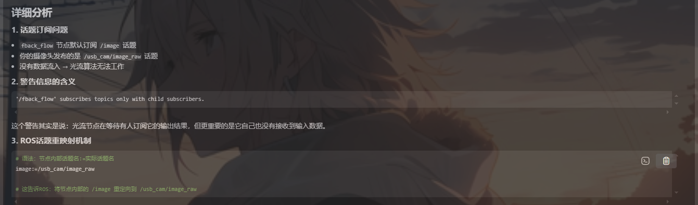

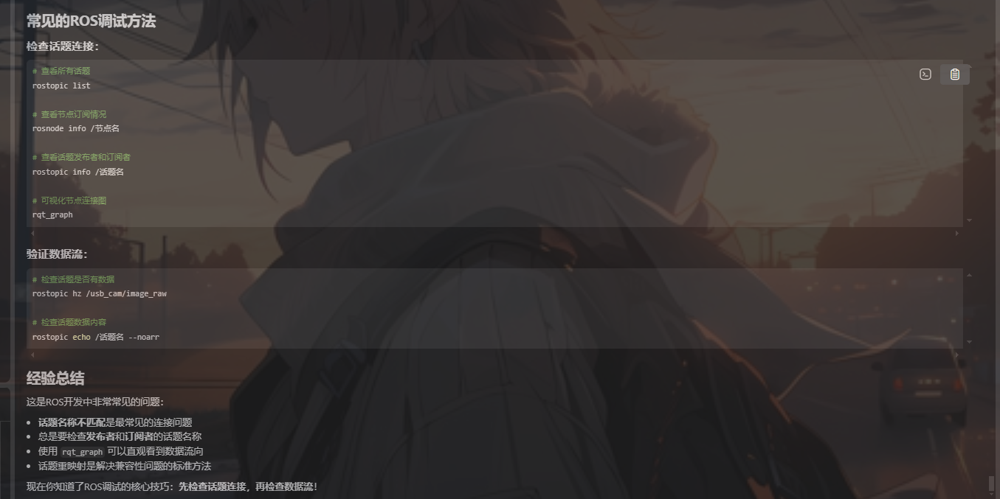

**opencv_apps包下的 fback_flow.launch文件，能查看最开始订阅的topic话题**

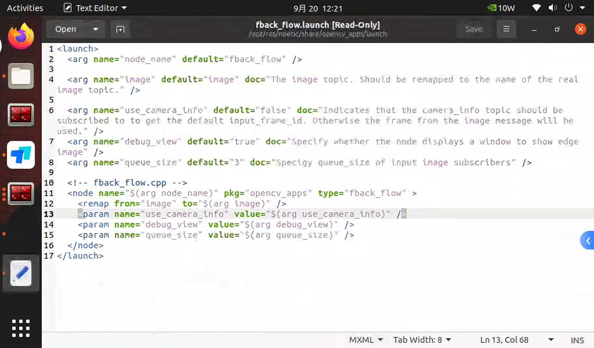

**该小车中的opencv_apps包中的fback_flow源码如下，确实是 初始化时，订阅了 /image 话题**

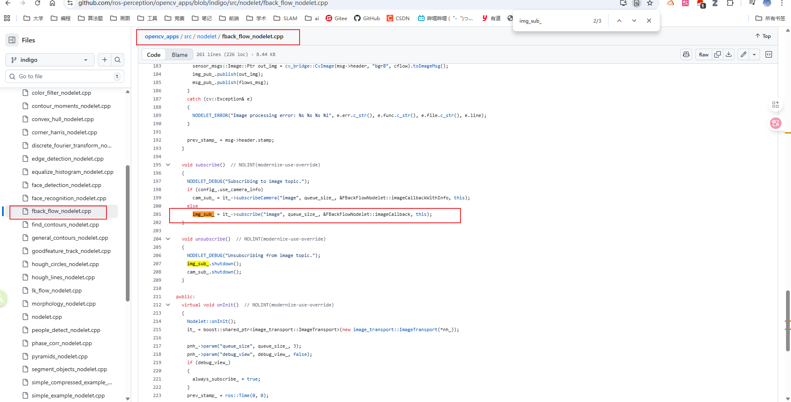

#### 3、同理，运行 edge_detection.launch文件后，看不到边缘检测的信息

~~~java
// 根据教程，这个代码 没指定 具体的topic。导致 出现了 能看见摄像头的数据，看不到 光流信息
roslaunch opencv_apps edge_detection.launch 

// 更正之后的代码----指定 具体的 topic话题
roslaunch opencv_apps edge_detection.launch image:=/usb_cam/image_raw
~~~

**edge_detection.launch 如下**

~~~xml
<launch>
  <arg name="node_name" default="edge_detection" />

   <-->下述代码，订阅了 image话题</-->
  <arg name="image" default="image" doc="The image topic. Should be remapped to the name of the real image topic." />

  <arg name="use_camera_info" default="false" doc="Indicates that the camera_info topic should be subscribed to to get the default input_frame_id. Otherwise the frame from the image message will be used." />
  <arg name="debug_view" default="true" doc="Specify whether the node displays a window to show edge image" />
  <arg name="queue_size" default="3" doc="Specigy queue_size of input image subscribers" />

  <arg name="edge_type" default="0" doc="Specify edge dtection methods. 0: Sobel Derivatives, 1: Lapalace Operator, 2, Canny Edge Detector." />
  <arg name="canny_threshold1" default="100" doc="Specify second canny threashold value." />
  <arg name="canny_threshold2" default="200" doc="Specity first canny threashold value." />
  <arg name="apertureSize" default="3" doc="Aperture size for the Sobel() operator." />
  <arg name="apply_blur_pre" default="true" doc="Flag, applying Blur() to input image" />
  <arg name="postBlurSize" default="13" doc="Aperture size for the Blur() to input image()" />
  <arg name="postBlurSigma" default="3.2" doc="Sigma for the GaussianBlur() to input image." />
  <arg name="apply_blur_post" default="false" doc="Flag, applying GaussinaBlur() to output(edge) image" />
  <arg name="L2gradient" default="false" doc="Flag, L2Gradient" />

  <!-- edge_detection.cpp  -->
  <node name="$(arg node_name)" pkg="opencv_apps" type="edge_detection" >
    <remap from="image" to="$(arg image)" />
    <param name="use_camera_info" value="$(arg use_camera_info)" />
    <param name="debug_view" value="$(arg debug_view)" />
    <param name="queue_size" value="$(arg queue_size)" />
    <param name="edge_type" value="$(arg edge_type)" />
    <param name="canny_threshold1" value="$(arg canny_threshold1)" />
    <param name="canny_threshold2" value="$(arg canny_threshold2)" />
    <param name="apertureSize" value="$(arg apertureSize)" />
    <param name="apply_blur_pre" value="$(arg apply_blur_pre)" />
    <param name="postBlurSize" value="$(arg postBlurSize)" />
    <param name="postBlurSigma" value="$(arg postBlurSigma)" />
    <param name="apply_blur_post" value="$(arg apply_blur_post)" />
    <param name="L2gradient" value="$(arg L2gradient)" />
  </node>
</launch>
~~~

####  4、同理，运行contour_moments.launch，也是没有显示轮廓距的信息

~~~java
roslaunch opencv_apps contour_moments.launch image:=/usb_cam/image_raw
~~~

~~~java
catkin_make --pkg intelligentcar_astra -j1

// 1、首先编译 ydlidar_ros_driver
catkin_make --pkg ydlidar_ros_driver -j1
    
    
~~~

### 3、激光雷达模块

#### 1、编译问题

始终显示没有 ydlidar-SDK模块，于是在 `/home/jetson/intelligentcar/src/ydlidar_ros_driver`目录下 克隆 YDLidar-SDK 模块并编译该模块。然后在`/intelligentcar`目录下 重新 编译。

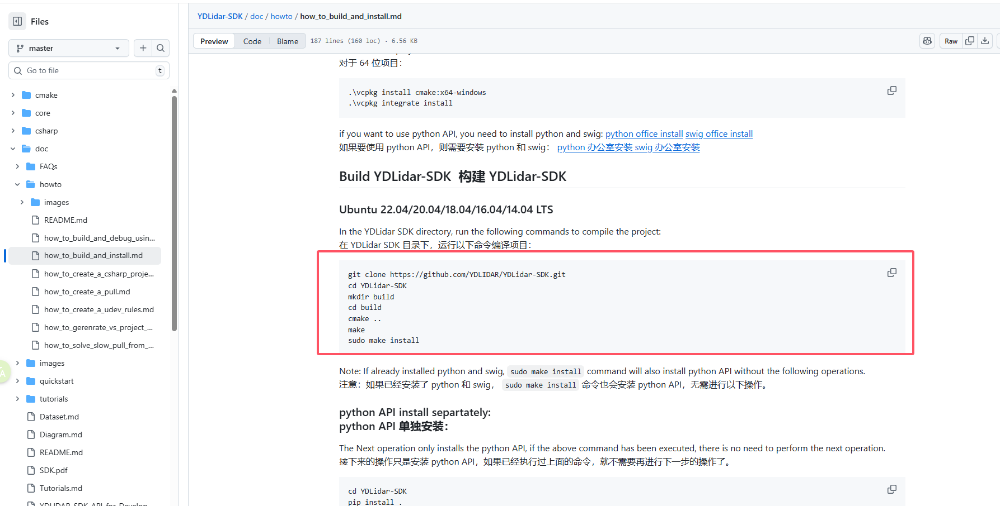

#### 2、运行 roslaunch intelligentcar_laser laser_Avoidance.launch

##### a、python环境问题

在这个命令中，会启动激光雷达，而 **laser_Avoidance_4ROS.py**文件第一行写的是 **\#!/usr/bin/env python** 而不是 **\#!/usr/bin/env python3**，而恰好环境有 python2和python3两个环境，导致这个py文件使用python2来启动，一直报如下错误（本质就是 该py文件使用了python3的语法，而使用python2来运行就报错）。

**解决方案**：涉及到的文件全部 改写为 **#!/usr/bin/env python3**

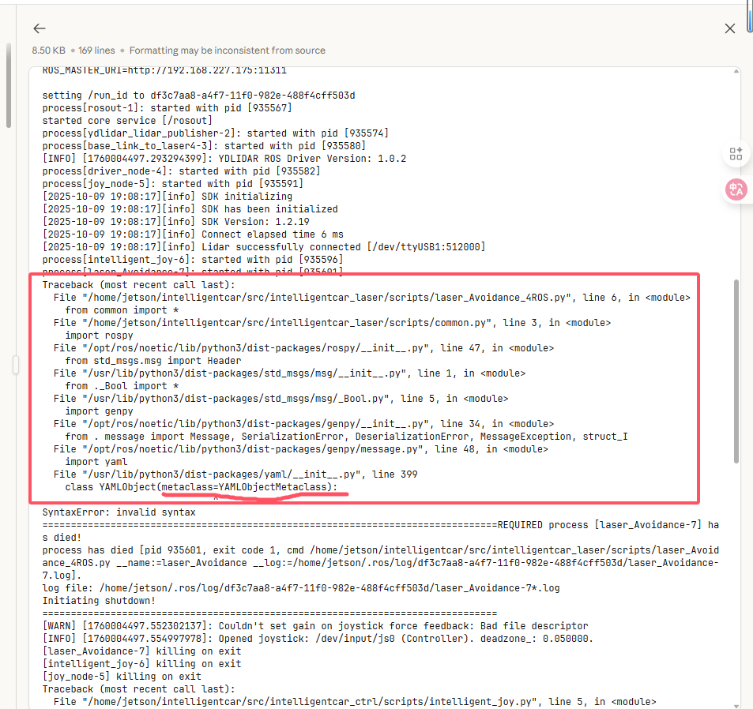

##### b、底盘驱动节点和激光雷达节点 的 USB串口冲突

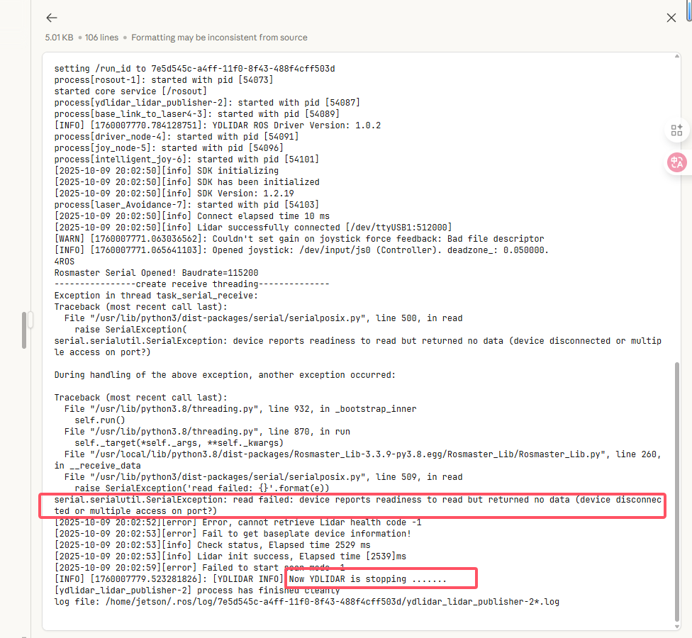

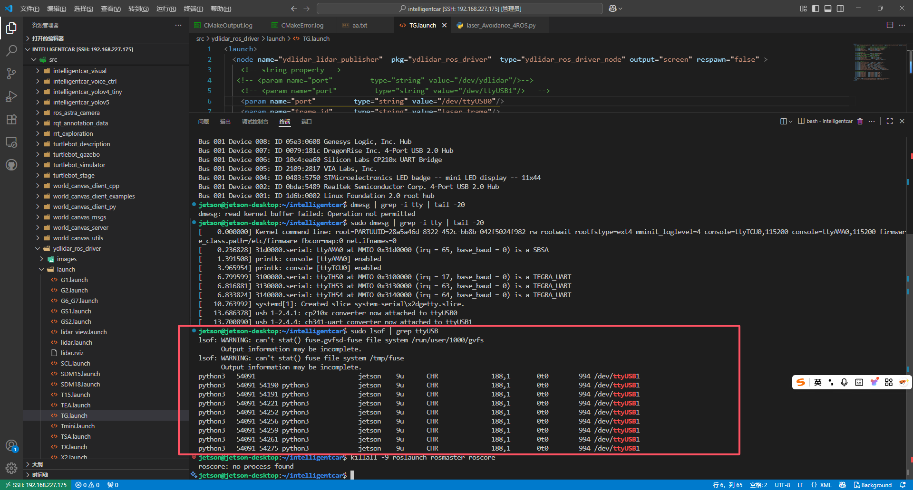

**解决方案**：把激光雷达节点的USB串口改到 ttyUSB0 上。（第二天再次运行时，还是出现串口冲突，又改回 ttyUSB1上了）

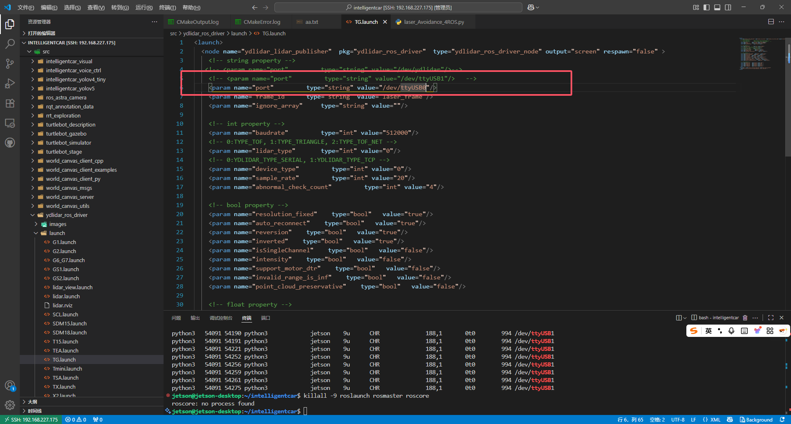

##### c、避障感觉有点问题

当运行起来后，似乎并不会避障，而是一个劲的往右前方走，调整了 避障距离还是不得行，小车都撞到障碍物了还是没有停下来。

**实际运行环境的topic情况如下：**

**官网上的运行环境的topic情况如下：**

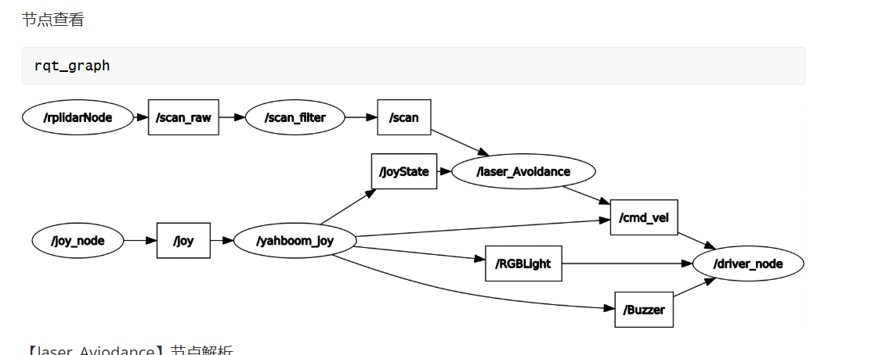

#### 3、运行 roslaunch intelligentcar_laser laser_Tracker.launch

##### a、python环境问题

跟上述 的 **3、2、a、python环境问题**一模一样。

**解决方案**：涉及到的文件全部 改写为 **#!/usr/bin/env python3**

雷达追踪暂时没有其他问题。

#### 4、建图定位

基本没什么太大的问题，唯一一个点就是激光雷达启动时，要注意查看日志信息，有可能USB串口被占用，就需要改串口或者重启试试。

### 4、深度相机模块

#### 1、物体追踪 KCFTracker.launch

##### a、没有**usb_cam**包，重新安装就行。

~~~nim
sudo apt install ros-noetic-usb-cam
# 然后再重新编译 intelligentcar
cd ~/intelligentcar
catkin_make
source devel/setup.bash

~~~

##### b、**深度相机没法启动**

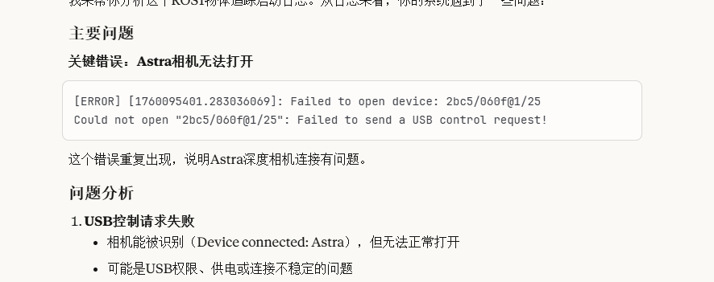

大概率都是没有正确加载驱动问题，在重新加载**udev规则**后，再重新插拔深度相机，然后再 roslaunch试试。

~~~nim
sudo udevadm control --reload-rules
sudo udevadm trigger
~~~

##### c、物体追踪不了问题

在相机正确启动，且能够框选物体后，小车无法实现追踪功能的话，有如下原因：

- 框选的物体可能过小
- 深度相机的范围是在 0.6m ~ 8m，所以跟随距离要得当。物体太远或者太近，在终端会看见 distance = nan的日志。

#### 2、颜色追踪

在框选颜色后，能看见黑白图，但就是小车不能移动。使用 **rqt_graph**查看各节点连接情况，发现缺少 **/driver_node** 节点，导致手柄和colorTracker发布的速度指令，缺少 /driver_node节点来消费，故小车不能移动。

**/cmd_vel 话题 发布者 订阅者情况如下**：

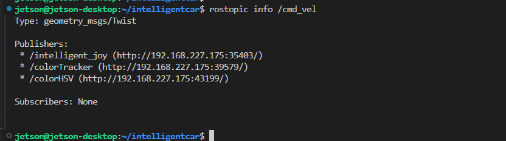

**colorTracker.launch文件如下**：

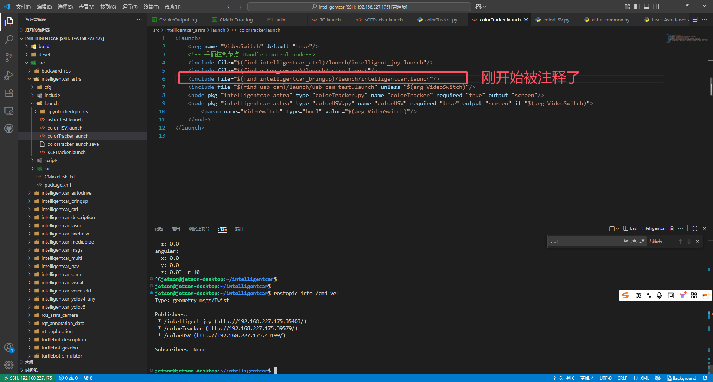
