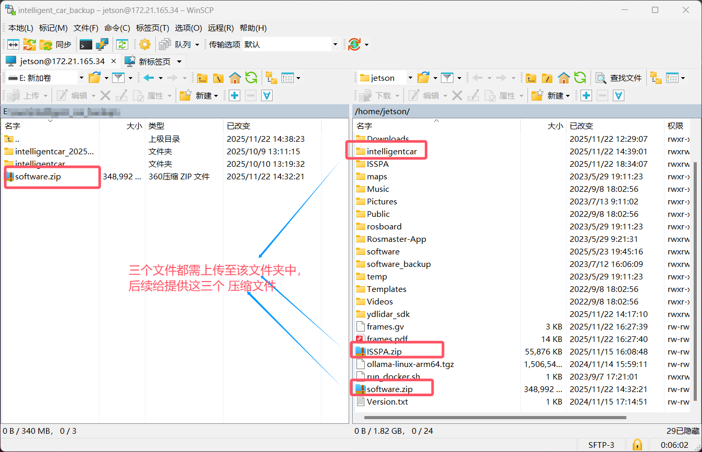
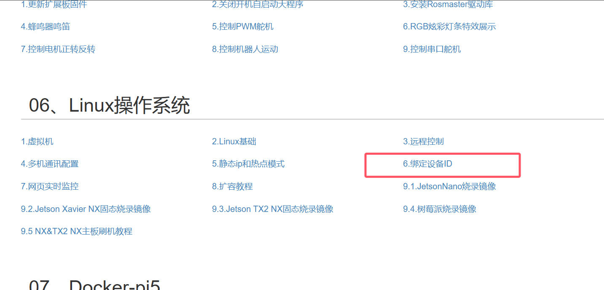
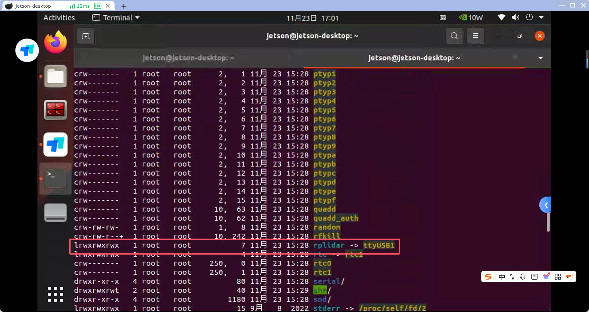
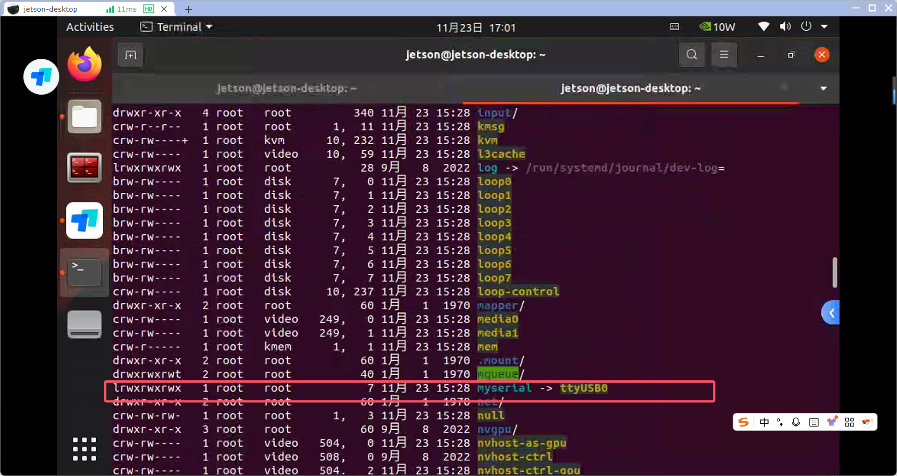
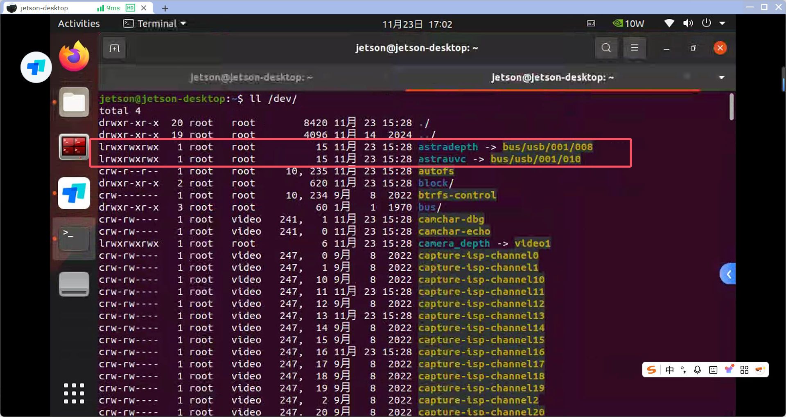

写在前面的话，先配置国内源，如果可以，还可自行配置 科学上网

配置 国内源：https://blog.csdn.net/qq_35451572/article/details/79516563

科学上网，某软件上 有 **allow lan**按键，具体自行查找。

### 1、装ros1

**确保当前操作系统是 ubuntu 20.04!!!**

**确保当前操作系统是 ubuntu 20.04!!!**

**确保当前操作系统是 ubuntu 20.04!!!**

~~~nim
# 检查当前系统版本
lsb_release -a
~~~

==**安装**==

1、启动所有软件源

~~~nim
sudo add-apt-repository universe
sudo add-apt-repository multiverse
sudo add-apt-repository restricted
~~~

2、清理并更新

~~~nim
sudo apt update
sudo apt clean
sudo apt autoremove
~~~

3、**尝试使用 `aptitude` 安装（智能解决依赖）：** aptitude 比 apt 更擅长处理依赖冲突。

~~~nim
# 添加 ROS 源
sudo sh -c 'echo "deb http://packages.ros.org/ros/ubuntu $(lsb_release -sc) main" > /etc/apt/sources.list.d/ros-latest.list'

# 添加密钥
sudo apt-key adv --keyserver 'hkp://keyserver.ubuntu.com:80' --recv-key C1CF6E31E6BADE8868B172B4F42ED6FBAB17C654

sudo apt install aptitude
sudo aptitude update
sudo aptitude install ros-noetic-desktop-full

# 或者使用 apt 尝试安装一下
# sudo apt install ros-noetic-desktop-full
~~~

注意：运行此命令后，它会给出一个解决方案。如果第一个方案是“保持现状（不安装）”，请输入 `n`（不接受），它会给出第二个方案（通常是降级某些包），这时输入 `y`（接受）。

**安装过程有些慢，大概率要20分钟左右！！！ 安装过程有些慢，大概率要20分钟左右！！！ 安装过程有些慢，大概率要20分钟左右！！！**

**==配置环境变量==**

~~~nim
echo "source /opt/ros/noetic/setup.bash" >> ~/.bashrc
source ~/.bashrc
~~~

**安装构建工具**

~~~nim
sudo apt install python3-rosdep python3-rosinstall python3-rosinstall-generator python3-wstool build-essential
~~~

安装 rosdepc ，智能解决依赖问题

~~~nim
# 完成上述 ros1的安装，理应来说已经有了python3的环境，可以直接运行如下命令
sudo pip3 install rosdepc

# rosdepc 初始化、更新
sudo rosdepc init
rosdepc update
~~~

### 2、**==拉取并编译 雷达SDK==**

在home目录下新建 ydlidar_sdk文件夹，克隆项目并完成编译安装，如下所示

~~~nim
cd ~

# 创建 SDK 安装目录
mkdir -p ~/ydlidar_sdk
cd ~/ydlidar_sdk

# 克隆 YDLIDAR SDK 仓库
# 如果没有git，需要 自行安装 git，该项目在github上，可能还需科学上网
git clone https://github.com/YDLIDAR/YDLidar-SDK.git
cd YDLidar-SDK

# 创建构建目录并编译
mkdir build
cd build
cmake ..
make -j$(nproc)

# 安装到系统
sudo make install

# 更新动态链接库缓存
sudo ldconfig
~~~

设置环境变量

~~~nim
# 添加 SDK 路径到环境变量
echo 'export YDLIDAR_SDK_DIR=$HOME/ydlidar_sdk/YDLidar-SDK' >> ~/.bashrc
source ~/.bashrc
~~~

### 3、**==拷贝software、项目等文件==**

首先备份 小车原系统中的software文件：

~~~nim
cd ~
mv software software_backup
~~~

使用 winscp软件，将本地电脑 software.zip文件拷贝至 小车上。登录账号：jetson。密码：yahboom

**如若winscp连不上 小车！！！如若winscp连不上 小车！！！如若winscp连不上 小车！！！**

请检查 小车和本地电脑是否处于**同一局域网内**

请检查 小车是否打开 **22端口**

~~~nim
# 打开 ssh就是打开22端口
sudo systemctl start ssh
~~~

如下所示：

拷贝完成后，解压 intelligentcar.zip、ISSPA-main.zip、software.zip 到当前路径即可。

~~~nim
cd ~
# 如果没有 unzip，还需自行安装
unzip intelligentcar.zip
unzip ISSPA-main.zip
unzip software.zip
~~~

常见的ros包，需自己手动安装

~~~nim
sudo apt install ros-noetic-uuid-msgs
~~~

### *4、*==配置 bashrc 文件==

~~~nim
cd ~
sudo mv .bashrc .bashrc_backup # 先备份
sudo vim ~/.bashrc # 会进入 vim编辑 bashrc文件
~~~

将下述内容粘贴进 bashrc文件中

~~~nim
# ~/.bashrc: executed by bash(1) for non-login shells.
# see /usr/share/doc/bash/examples/startup-files (in the package bash-doc)
# for examples

export RPLIDAR_TYPE=4ROS
export ROBOT_TYPE=R2
export CAMERA_TYPE=astraplus

# If not running interactively, don't do anything
case $- in
    *i*) ;;
      *) return;;
esac

# don't put duplicate lines or lines starting with space in the history.
# See bash(1) for more options
HISTCONTROL=ignoreboth

# append to the history file, don't overwrite it
shopt -s histappend

# for setting history length see HISTSIZE and HISTFILESIZE in bash(1)
HISTSIZE=1000
HISTFILESIZE=2000

# check the window size after each command and, if necessary,
# update the values of LINES and COLUMNS.
shopt -s checkwinsize

# If set, the pattern "**" used in a pathname expansion context will
# match all files and zero or more directories and subdirectories.
#shopt -s globstar

# make less more friendly for non-text input files, see lesspipe(1)
[ -x /usr/bin/lesspipe ] && eval "$(SHELL=/bin/sh lesspipe)"

# set variable identifying the chroot you work in (used in the prompt below)
if [ -z "${debian_chroot:-}" ] && [ -r /etc/debian_chroot ]; then
    debian_chroot=$(cat /etc/debian_chroot)
fi

# set a fancy prompt (non-color, unless we know we "want" color)
case "$TERM" in
    xterm-color|*-256color) color_prompt=yes;;
esac

# uncomment for a colored prompt, if the terminal has the capability; turned
# off by default to not distract the user: the focus in a terminal window
# should be on the output of commands, not on the prompt
#force_color_prompt=yes

if [ -n "$force_color_prompt" ]; then
    if [ -x /usr/bin/tput ] && tput setaf 1 >&/dev/null; then
	# We have color support; assume it's compliant with Ecma-48
	# (ISO/IEC-6429). (Lack of such support is extremely rare, and such
	# a case would tend to support setf rather than setaf.)
	color_prompt=yes
    else
	color_prompt=
    fi
fi

if [ "$color_prompt" = yes ]; then
    PS1='${debian_chroot:+($debian_chroot)}\[\033[01;32m\]\u@\h\[\033[00m\]:\[\033[01;34m\]\w\[\033[00m\]\$ '
else
    PS1='${debian_chroot:+($debian_chroot)}\u@\h:\w\$ '
fi
unset color_prompt force_color_prompt

# If this is an xterm set the title to user@host:dir
case "$TERM" in
xterm*|rxvt*)
    PS1="\[\e]0;${debian_chroot:+($debian_chroot)}\u@\h: \w\a\]$PS1"
    ;;
*)
    ;;
esac

# enable color support of ls and also add handy aliases
if [ -x /usr/bin/dircolors ]; then
    test -r ~/.dircolors && eval "$(dircolors -b ~/.dircolors)" || eval "$(dircolors -b)"
    alias ls='ls --color=auto'
    #alias dir='dir --color=auto'
    #alias vdir='vdir --color=auto'

    alias grep='grep --color=auto'
    alias fgrep='fgrep --color=auto'
    alias egrep='egrep --color=auto'
fi

# colored GCC warnings and errors
#export GCC_COLORS='error=01;31:warning=01;35:note=01;36:caret=01;32:locus=01:quote=01'

# some more ls aliases
alias ll='ls -alF'
alias la='ls -A'
alias l='ls -CF'

# Add an "alert" alias for long running commands.  Use like so:
#   sleep 10; alert
alias alert='notify-send --urgency=low -i "$([ $? = 0 ] && echo terminal || echo error)" "$(history|tail -n1|sed -e '\''s/^\s*[0-9]\+\s*//;s/[;&|]\s*alert$//'\'')"'

# Alias definitions.
# You may want to put all your additions into a separate file like
# ~/.bash_aliases, instead of adding them here directly.
# See /usr/share/doc/bash-doc/examples in the bash-doc package.

if [ -f ~/.bash_aliases ]; then
    . ~/.bash_aliases
fi

# enable programmable completion features (you don't need to enable
# this, if it's already enabled in /etc/bash.bashrc and /etc/profile
# sources /etc/bash.bashrc).
if ! shopt -oq posix; then
  if [ -f /usr/share/bash-completion/bash_completion ]; then
    . /usr/share/bash-completion/bash_completion
  elif [ -f /etc/bash_completion ]; then
    . /etc/bash_completion
  fi
fi
alias python=python3
ip=$(ip addr show wlan0 | grep -o 'inet [0-9]\+\.[0-9]\+\.[0-9]\+\.[0-9]\+' | grep -o [0-9].*)
if [ -z $ip ]; then
  ip=$(ip addr show lo | grep -o 'inet [0-9]\+\.[0-9]\+\.[0-9]\+\.[0-9]\+' | grep -o [0-9].*)
fi
echo "-----------------------"
echo -e "MY_IP: \033[32m$ip\033[0m"
echo "-----------------------"

source /opt/ros/noetic/setup.bash
export YDLIDAR_SDK_DIR=$HOME/ydlidar_sdk/YDLidar-SDK
# >>> fishros initialize >>>

# project_1: auto driver
# source ~/ISSPA/devel/setup.bash

# project_2: intelligent_car
source ~/intelligentcar/devel/setup.bash

export ASTRA_SDK_INCLUDE=/home/jetson/software/AstraSDK-v2.1.3-Ubuntu18.04-x86_64/include
export ASTRA_SDK_LIB=/home/jetson/software/AstraSDK-v2.1.3-Ubuntu18.04-x86_64/lib

# basic environment
export rtabmap_DIR=/usr/local/lib/cmake/rtabmap-0.20
export PYTHONPATH=$PYTHONPATH:/opt/ros/noetic/lib/python3/dist-packages
export PYTHONPATH=/usr/lib/python3/dist-packages:$PYTHONPATH

# WARN! WARN! WARN!
# Nomally, only the follwing IP needs to be modified
export ROS_MASTER_URI=http://172.21.165.34:11311
export ROS_HOSTNAME=172.21.165.34
#export ROS_IP=192.168.228.175
~~~

### 5、**==配置端口映射==**

视频链接如下：https://www.yahboom.com/build.html?id=5284&cid=552

上述配置完成后，理应结果如下所示，myserial -> ttyUSB0, rplidar -> ttyUSB1

完成上述流程后，解压好 intelligentcar之后，就可以进入 该文件夹中，编译该项目

~~~nim
cd ~
cd intelligentcar

# 编译项目时，可能会报缺少某某ros包，缺少什么ros包，安装什么ros包即可
catkin_make # 编译项目

# 也可能在编译时，出现 类似于 saveMap.cpp 文件不存在类似的
# 大概率就是编译顺序问题，该项目有些模块的编译 是依赖于 前面某一个模块的编译结果
# 此时使用 单线程编译 即可
catkin_make -j1

# 单线程编译也可能出现问题，回过头在使用 多线程编译即可
catkin_make

# 重复上述过程，是能编译好的
~~~

### 6、**==以下就是可能在其他模块运行时会报的错误，酌情安装即可==**

**雷达建图导航**

~~~nim
sudo apt update
sudo apt install ros-noetic-slam-gmapping
    
# 或者使用 apt 安装
sudo apt install python3-sklearn python3-sklearn-lib
sudo apt install ros-noetic-navigation

sudo apt install ros-noetic-imu-filter-madgwick
sudo apt install ros-noetic-robot-localization
~~~

~~~nim

# 用户层面
pip3 uninstall cffi
# 系统层面
sudo pip3 uninstall cffi
~~~

**深度相机模块**

~~~nim
sudo apt install ros-noetic-usb-cam
~~~

### 7、==**可能会出现的问题**==

**删除文件时，慎重！！！请考虑 是否应该删除文件，不要一股脑相信ai的话**

**删除文件时，慎重！！！请考虑 是否应该删除文件，不要一股脑相信ai的话**

**删除文件时，慎重！！！请考虑 是否应该删除文件，不要一股脑相信ai的话**

按照上述流程走完之后，可能在使用 rostopic命令时，会报错，**有可能**是 cffi冲突。将报错信息 粘贴进 ai中，会提示你删除某某 cffi文件，如下所示：

~~~nim
# 删除用户级别的cffi
pip3 uninstall cffi
~~~

删除一次 cffi文件后，可能还是会报 cffi冲突，大概率是 系统层面还有一个 cffi文件冲突，还是将报错信息粘贴进ai，会提示你 删除 系统层面的cffi文件。

~~~nim
# 删除系统层面的cffi文件
sudo pip3 uninstall cffi
~~~

